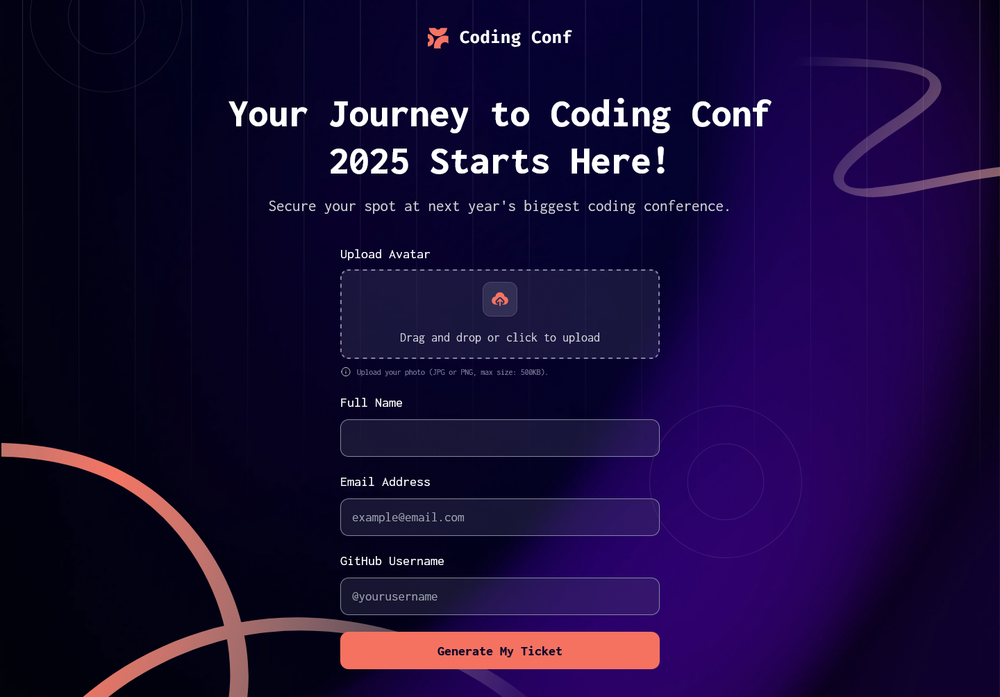

# Frontend Mentor - Conference ticket generator solution

This is a solution to the [Conference ticket generator challenge on Frontend Mentor](https://www.frontendmentor.io/challenges/conference-ticket-generator-oq5gFIU12w). Frontend Mentor challenges help you improve your coding skills by building realistic projects.

## Table of contents

- [Overview](#overview)
  - [The challenge](#the-challenge)
  - [Screenshot](#screenshot)
  - [Links](#links)
- [My process](#my-process)
  - [Built with](#built-with)
  - [What I learned](#what-i-learned)
  - [Continued development](#continued-development)
  - [Useful resources](#useful-resources)
- [Author](#author)

## Overview

### The challenge

Users should be able to:

- Complete the form with their details
- Receive form validation messages if:
  - Any field is missed
  - The email address is not formatted correctly
  - The avatar upload is too big or the wrong image format
- Complete the form only using their keyboard
- Have inputs, form field hints, and error messages announced on their screen reader
- See the generated conference ticket when they successfully submit the form
- View the optimal layout for the interface depending on their device's screen size
- See hover and focus states for all interactive elements on the page

### Screenshot



### Links

- Solution URL: [See the solution](https://github.com/JustANipple/conference-ticket-generator)
- Live Site URL: [See it live](https://justanipple.github.io/conference-ticket-generator/)

## My process

### Built with

- Semantic HTML5 markup
- CSS custom properties
- Flexbox
- CSS Grid
- Mobile-first workflow
- TailwindCSS

### What I learned

I made a custom multi layered background

```css
.bg-custom {
  background-image: url("/assets/images/pattern-squiggly-line-bottom-mobile-tablet.svg"),
    url("/assets/images/pattern-circle.svg"),
    url("/assets/images/pattern-squiggly-line-top.svg"),
    url("/assets/images/pattern-lines.svg"),
    url("/assets/images/background-mobile.png");

  background-position:
    bottom left,
    top -30px left -20px,
    right top 24px,
    top right -5px,
    center;
  background-size: 300px, 107px, 112px, 990px, cover;
  background-repeat: no-repeat;
  min-height: 100vh;
}
```

### Continued development

For my next projects i will be using the new TailwindCSS 4.0

### Useful resources

- [TailwindCSS](https://tailwindcss.com/docs/installation/using-vite) - This helped me with the styling. Very useful and easy to get into

## Author

- Frontend Mentor - [@JustANipple](https://www.frontendmentor.io/profile/JustANipple)
